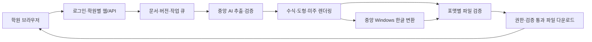

# Devin 최종 개발 인계 — ExamDNA

**목표:** 여러 학원 선생님이 웹에서 시험지 사진/PDF를 올리고, 원문·도형·수식·답안 공간을 보존한 편집 가능한 한글 파일과 정답·풀이 미주를 받는 서비스.

**사용자가 확정한 운영 방식:** 학원은 웹만 사용한다. 플랫폼이 중앙 AI·Windows 한글 변환을 제공한다. Codex 구독은 개발·검증에 사용하며, 운영 공용 계정으로 쓰지 않는다. Gemini는 기본 구성에서 제외한다.

현재 저장소는 이 목표를 완성한 상태가 아니다. 이 패키지는 **개발 명세와 인수 계약**이며, 제품 코드를 고쳤거나 새 테스트를 통과했다는 보고가 아니다.

시작 지시서에는 실패 재현→회귀 테스트→구현→실물 확인→독립 검토의 반복 규칙과 완료 증거 목록을 추가했다. 테스트·검증 기준을 약화해 성공을 만들거나 미실행 검증을 통과로 보고하지 못하도록 명시했다. 추가 문구는 기존 V1 계약의 실행·보고 기준을 구체화하며 기능 범위를 확대하지 않는다.

## 바로 인계하는 방법

1. 이 패키지 ZIP을 Devin 작업에 첨부한다.
2. [DEVIN_START_PROMPT.md](./DEVIN_START_PROMPT.md)의 본문을 시작 지시로 전달한다.
3. Devin은 저장소 최신 HEAD와 감사 기준 `0c1fb5dc8223d52889ca676bed13ad2e7d93fa4a`를 대조하고 WP00부터 시작한다.
4. 배포 전에 필요한 운영 계정/비용/한글 환경·사용 조건의 결정은 RG 목록으로 관리한다. 자료가 없다는 이유로 계약·mock·코어 구현을 멈추지 않되, 외부 가입·결제·학생 원본 전송·공개 배포를 임의로 수행하지 않는다.

이 패키지를 Devin에 자동으로 전송하거나 원격 작업을 생성하지 않았다. 원본 JPG/HWP와 API 키·개인 Codex 자격 증명은 배포용 ZIP에 넣지 않는다. 실물 평가 자료는 [제한 자료 목록](./evidence/RESTRICTED_DATA_MANIFEST.md)에 따라 별도로 관리한다.

## 핵심 개발 결정

- 기존 Next.js/FastAPI를 기반으로 학원 격리·권한·영속 작업을 추가한다.
- 원본은 불변으로 유지하며, canonical Document revision만 의미 내용을 관리한다. ATU 확정과 실제 본문이 따로 움직이지 않는다.
- AI는 후보/변경안을 만들고, 프로그램은 schema·권한·논리·버전·출고를 통제한다.
- 도형은 관계를 보존해 실제로 재작도한다. 수학 숫자·단위에는 실제 수식 객체와 11pt/it/roman을 적용하고, 정답·풀이는 실제 미주를 사용한다.
- 원문 복원과 의도된 편집을 구분한다. 편집은 변경안→명시적 적용→새 revision→영향 범위 재검증→새 artifact로 이어진다.
- 내부 초안 생성→그 파일의 proof→해당 포맷 최종 다운로드 순서다. 미실행/불가/오류는 최종 검증 통과가 아니다.
- 학원 사용자가 원본의 불확실한 부분만 검토하도록 돕되, 불확실성을 숨겨 작업량을 줄이지 않는다.

## 읽는 순서

Codex 구독은 이 운영 흐름과 분리된 개발·QA 도구다. OpenAI API 계정·비용·자료 처리 설정과 Windows 한글 사용 조건은 플랫폼 운영자가 관리한다.

| 순서 | 문서 | 용도 |
|---|---|---|
| 1 | [01 제품 요구사항](./01_PRODUCT_REQUIREMENTS.md) | V1 범위와 REQ-01~28, 최신 사용자 요구 |
| 2 | [02 아키텍처·계약](./02_ARCHITECTURE_CONTRACTS.md) | 데이터·권한·revision·API·job·proof·worker |
| 3 | [03 페이지·팝업 UX](./03_PAGE_UX_SPEC.md) | 화면별 행동·상태·복구·모바일·접근성 |
| 4 | [04 인수 테스트](./04_ACCEPTANCE_TEST_PLAN.md) | AT-001~060과 실제 한글/브라우저/보안·품질 증거 |
| 5 | [05 개발 순서](./05_DELIVERY_PLAN.md) | WP00~11, 의존성, PR별 완료 조건 |
| 6 | [06 AI·비용·운영](./06_AI_COST_AND_OPERATIONS.md) | 개발 Codex/운영 API 분리, 모델 평가/예산/Windows |
| 7 | [07 결정·출시 gate](./07_DECISIONS_AND_RELEASE_GATES.md) | 확정 사항/제안/운영 결정과 대안 |
| 8 | [08 실제 자료 수집·반복 테스트](./08_CORPUS_AND_CONTINUOUS_TESTING.md) | 자료 검수·개발/잠금 평가 분리·실패 수정 루프 |
| 9 | [09 포지셔닝·디자인·성능·단위경제성](./09_PRODUCT_POSITIONING_AND_UNIT_ECONOMICS.md) | 무설치·무API키 UX, SLO, 가격·원가·margin gate |

작업용 표: [요구·감사·테스트 추적표](./TRACEABILITY.csv), [개발 backlog](./BACKLOG.csv), [인수 결과 기록 양식](./ACCEPTANCE_RESULTS_TEMPLATE.csv).

경쟁 서비스의 공개 도움말·업데이트에서 추출한 반복 결함과 launch checklist: [매쓰테일러 심층 검토](./MATHTAILER_HELP_UPDATE_DEEP_DIVE.md).

기존 타학원 HWP의 제목·워터마크·쪽번호를 안전하게 교체하는 구조/UX/proof 계약: [HWP 리브랜딩 명세](./HWP_REBRANDING_SPEC.md).

문서 정합성은 [독립 검토 결과](./REVIEW_VERDICT.md)에서 PASS 판정을 받았다. 이 판정은 개발 인계 문서에 대한 것이며 제품 구현·테스트·출시 완료를 뜻하지 않는다.

독립 검토 PASS는01~07의기본계약범위다. 이후추가한08은기존F0~F4/REQ-27을구체화한수집운영지침이며,별도대규모데이터확보나새모델검증완료를뜻하지않는다. 현재공개후보11곳을조사했고외부보조답안한쌍을검수했다. 한국수학핵심전장시험지묶음은이번수집에서아직확보되지않았다.

## 이미 확인된 실패를 먼저 차단

실물 감사에서 인쇄 도형선 삭제, 학생 필기 잔존, 기존 Golden 정답 7개 오류, 잘못된 결과의 VERIFIED_FINAL, 실제 수식/도형/미주가 0개인 한글 출력이 확인됐다. 일반 코드 감사에서는 검토 확정의 본문 미반영, 편집 후 이전 정답 유지, stale HWP, 미검증 다운로드와 오류 복구 문제도 있었다. [기준 감사 요약](./evidence/BASELINE_FINDINGS.md)을 먼저 읽는다.

심원중 샘플은 대문항 23개/채점 단위 28개/부모 포함 31노드/100점이며, 객관식 보기 100개와 4번의 별도 보기 3개가 있다. 기존 29행을 문항 수 합격 기준으로 쓰지 않는다. 참고 HWP에도 오류/10pt 수식/풀이 부재가 있으므로 그대로 모사하지 않는다.

## 출시 판정

계약·mock만 통과한 개발 완료, 실물 한 샘플의 Alpha, 제한 Pilot, 공개 V1을 구분한다. 지원 범위의 독립 평가와 실제 한글 3형식·학원 격리·백업 복구 증거가 있어야 V1 출시로 보고한다. 임의의 모든 사진을 100% 복원한다고 보장하지 않는다. 대신 확인하지 못한 내용/파일이 최종본으로 나가지 않도록 한다.

제안된 모델·수치 기준·운영 설정은 WP00에서 실측과 책임자 결정으로 고정한다. 기존 사용량/정확도나 이미 구현된 사실처럼 표시하지 않는다.
